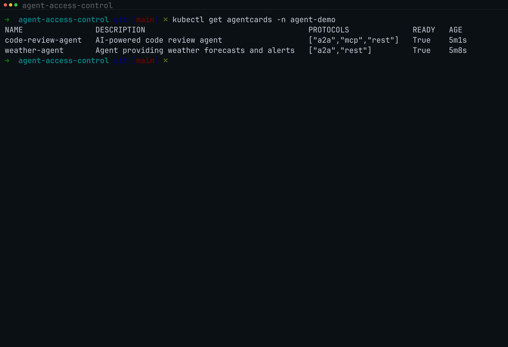
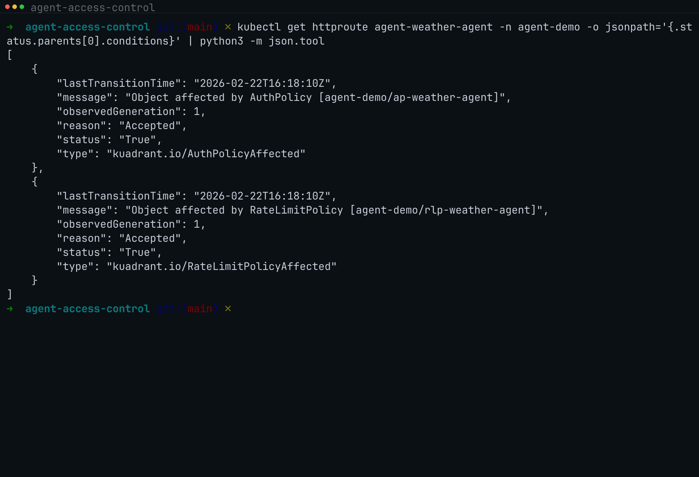

# Agent Access Control

**Zero-code security for AI agents on Kubernetes.**

Every agent team rebuilds the same auth, rate limiting, and credential management from scratch. This controller eliminates that. Define _who_ can call your agents, _what_ they can call, and _which_ external APIs they can reach -- in two CRDs. The controller generates Gateway API HTTPRoutes, Kuadrant AuthPolicies, RateLimitPolicies, sidecar configs, and MCP registrations automatically. Agents ship with business logic only.

> **Status**: proof-of-concept. APIs will change.

## Demos

### Setup & Lifecycle (6:42)

CRD installation, AgentCard/AgentPolicy creation, controller reconciliation, generated resource inspection, and cascade deletion — all on a live OpenShift cluster with Gateway API and Kuadrant.

[](hack/demo.mp4)

> [Watch the full demo](hack/demo.mp4)

### Access Control in Action (5:57)

The three layers of enforcement: inbound JWT auth via Authorino, per-tier rate limiting via Limitador, and outbound credential management (Vault, token exchange, default deny) via the sidecar proxy.

[](hack/demo-access-control.mp4)

> [Watch the full demo](hack/demo-access-control.mp4)

## How It Works

The controller watches two CRDs and generates all downstream infrastructure:


1. An **AgentCard** represents an agent's identity: description, protocols, skills, and service port. AgentCards are **discovered automatically** from running agents — not written by developers. A2A agents expose `/.well-known/agent.json`, MCP agents expose `tools/list`, and the discovery controller creates the AgentCard CR from this metadata.
2. An **AgentPolicy** selects one or more AgentCards by label, then declares ingress rules, agent-to-agent permissions, MCP tool federation, external credential policies, and rate limits.
3. The controller watches both resources and generates the downstream Kubernetes objects that enforce the policy.

### Who does what


- **Agent developers** deploy their agent (`Deployment` + `Service`) with a label `kagenti.com/agent: "true"`. That's it. No CRDs, no gateway config, no auth code.
- **Discovery controller** detects labeled agents, fetches their agent card / capabilities, and creates the `AgentCard` CR automatically.
- **Platform teams** create `AgentPolicy` CRs to define access rules per tier.
- The **policy controller** generates everything in between: HTTPRoutes, AuthPolicies, RateLimitPolicies, ConfigMaps, and MCPServerRegistrations.

### Traffic flow


| Call type | Path | Enforced by |
|---|---|---|
| User/client to agent | Caller -> Gateway -> Agent | Gateway (Authorino + Limitador) |
| Agent to agent | Agent A -> Gateway -> Agent B | Gateway (AuthPolicy) |
| Agent to MCP tools | Agent -> Gateway -> MCP Gateway -> MCP server | Gateway + MCP Gateway |
| Agent to external API | Agent -> Sidecar (vault/exchange) -> External | Sidecar forward proxy |
| Agent to blocked host | Agent -> Sidecar (deny) | Sidecar |

## Prerequisites

| Requirement | Version | Notes |
|---|---|---|
| Go | 1.24+ | Build dependency |
| kubectl | any recent | Cluster access |
| Kubernetes cluster | 1.28+ | Gateway API v1 support |
| Gateway API CRDs | v1.2+ | `kubectl apply -f https://github.com/kubernetes-sigs/gateway-api/releases/download/v1.2.1/standard-install.yaml` |
| Kuadrant | (optional) | AuthPolicy / RateLimitPolicy enforcement |
| MCP Gateway | (optional) | MCP tool federation via MCPServerRegistration |

## Quick Start

```bash
# Clone the repo
git clone https://github.com/agentoperations/agent-access-control.git
cd agent-access-control

# Build the controller binary
make build

# Generate and install CRDs into the cluster
make install

# Run the controller locally (connects to current kubeconfig context)
make run -- --gateway-name=my-gateway --gateway-namespace=default

# In another terminal, apply the sample resources
kubectl apply -f config/samples/

# Verify generated resources
kubectl get agentcards
kubectl get agentpolicies
kubectl get httproutes -l kagenti.com/managed-by=agent-access-control
kubectl get configmaps -l kagenti.com/managed-by=agent-access-control
```

## Testing

### Without a cluster (unit/build verification)

```bash
# Build and vet
make build
go vet ./...

# Run tests
make test
```

### With a local cluster (kind)

```bash
# Create a kind cluster
kind create cluster --name agent-test

# Install Gateway API CRDs
kubectl apply -f https://github.com/kubernetes-sigs/gateway-api/releases/download/v1.2.1/standard-install.yaml

# Install agent-access-control CRDs
make install

# Verify CRDs are registered
kubectl get crd agentcards.kagenti.com
kubectl get crd agentpolicies.kagenti.com

# Run controller locally
make run -- --gateway-name=test-gateway --gateway-namespace=default &

# Create a dummy service (simulates an agent)
kubectl create deployment weather-agent --image=nginx --port=8080
kubectl expose deployment weather-agent --name=weather-agent-svc --port=8080

# Apply sample AgentCard
kubectl apply -f config/samples/agentcard-weather.yaml

# Check: HTTPRoute should be generated
kubectl get httproutes -l kagenti.com/agent-card=weather-agent
kubectl get agentcard weather-agent -o yaml  # check status.conditions

# Apply sample AgentPolicy
kubectl apply -f config/samples/agentpolicy-standard.yaml

# Check: ConfigMap should be generated (AuthPolicy/RateLimitPolicy skipped without Kuadrant)
kubectl get configmaps -l kagenti.com/managed-by=agent-access-control
kubectl get agentpolicy standard-tier -o yaml  # check status

# Inspect the sidecar config
kubectl get configmap sidecar-config-weather-agent -o yaml

# Cleanup
kubectl delete -f config/samples/
kind delete cluster --name agent-test
```

### With Kuadrant (full policy enforcement)

If Kuadrant is installed on the cluster, the controller also generates AuthPolicy and RateLimitPolicy resources:

```bash
# Verify Kuadrant CRDs exist
kubectl get crd authpolicies.kuadrant.io
kubectl get crd ratelimitpolicies.kuadrant.io

# After applying samples, check generated policies
kubectl get authpolicies -l kagenti.com/managed-by=agent-access-control
kubectl get ratelimitpolicies -l kagenti.com/managed-by=agent-access-control
```

Without Kuadrant, the controller logs a warning and sets a status condition -- it does not crash.

## Deploying to Kubernetes / OpenShift

### Build and push the container image

```bash
# Build the image (default: quay.io/azaalouk/agent-access-control:latest)
make docker-build

# Or with a custom image name
make docker-build IMG=quay.io/myorg/agent-access-control:v0.1.0

# Push to registry
make docker-push
```

### Deploy the controller

```bash
# Install CRDs + RBAC + controller deployment
make deploy
```

This creates:
- Namespace `agent-access-control-system`
- ServiceAccount, ClusterRole, and ClusterRoleBinding
- Controller Deployment with health probes, resource limits, and security context

### Configure the target gateway

Edit the gateway name and namespace in the deployment before applying:

```bash
# Set your gateway name and namespace
kubectl set env deployment/agent-access-controller \
  GATEWAY_NAME=my-gateway \
  GATEWAY_NAMESPACE=my-namespace \
  -n agent-access-control-system
```

Or edit `deploy/manager.yaml` directly before deploying.

### Verify the controller is running

```bash
kubectl get pods -n agent-access-control-system
kubectl logs -n agent-access-control-system deployment/agent-access-controller
```

### Uninstall

```bash
make undeploy    # Remove controller, RBAC, namespace
make uninstall   # Remove CRDs (deletes all AgentCards and AgentPolicies)
```

## CRD Reference

### AgentCard (`agentcards.kagenti.com`)

```yaml
apiVersion: kagenti.com/v1alpha1
kind: AgentCard
metadata:
  name: my-agent
  labels:
    tier: standard          # used by AgentPolicy selector
spec:
  description: "What this agent does"
  protocols: [a2a, rest]    # a2a, mcp, rest
  skills:
    - name: skill-name
      description: "What this skill does"
  servicePort: 8080         # default 8080, convention: Service = {name}-svc
```

| Field | Type | Required | Description |
|---|---|---|---|
| `spec.description` | `string` | No | Human-readable description |
| `spec.protocols` | `[]string` | Yes (min 1) | `a2a`, `mcp`, `rest` |
| `spec.skills` | `[]AgentSkill` | No | Agent capabilities |
| `spec.servicePort` | `int32` | No | Service port (default `8080`) |

**Convention**: The agent's Kubernetes Service must be named `{agentcard-name}-svc`.

### AgentPolicy (`agentpolicies.kagenti.com`)

```yaml
apiVersion: kagenti.com/v1alpha1
kind: AgentPolicy
metadata:
  name: my-policy
spec:
  agentSelector:
    matchLabels:
      tier: standard        # selects AgentCards with this label

  ingress:                   # who can call these agents (gateway enforces)
    allowedAgents: [orchestrator]
    allowedUsers: ["*"]

  agents: [summarizer]       # which agents these can call (gateway enforces)

  mcpTools:                  # MCP tool filtering (MCP Gateway enforces)
    virtualServerRef: my-vs

  external:                  # outbound to external APIs (sidecar enforces)
    defaultMode: deny
    rules:
      - host: api.example.com
        mode: vault
        vaultPath: secret/data/api-key
        header: Authorization
        headerPrefix: "Bearer "

  rateLimit:                 # rate limiting (gateway enforces)
    requestsPerMinute: 100
```

| Field | Type | Required | Description |
|---|---|---|---|
| `spec.agentSelector.matchLabels` | `map[string]string` | Yes | Selects AgentCards by label |
| `spec.ingress.allowedAgents` | `[]string` | No | Agents permitted to call |
| `spec.ingress.allowedUsers` | `[]string` | No | Users permitted to call (`*` = any) |
| `spec.agents` | `[]string` | No | Outbound agent-to-agent permissions |
| `spec.mcpTools.virtualServerRef` | `string` | No | MCPVirtualServer name |
| `spec.external.defaultMode` | `string` | No | Default: `deny` |
| `spec.external.rules[].host` | `string` | Yes | Target hostname |
| `spec.external.rules[].mode` | `string` | Yes | `vault`, `exchange`, `passthrough`, `deny` |
| `spec.external.rules[].vaultPath` | `string` | No | Vault secret path |
| `spec.external.rules[].audience` | `string` | No | Token exchange audience |
| `spec.external.rules[].scopes` | `[]string` | No | Token exchange scopes |
| `spec.external.rules[].header` | `string` | No | Default: `Authorization` |
| `spec.external.rules[].headerPrefix` | `string` | No | Default: `Bearer ` |
| `spec.rateLimit.requestsPerMinute` | `int` | No | Max requests/min |

## Generated Resources

| Input | Generated Resource | Purpose |
|---|---|---|
| AgentCard | `HTTPRoute` | Routes traffic to the agent through the Gateway |
| AgentCard (protocol=mcp) | `MCPServerRegistration` | Registers agent as MCP server with MCP Gateway |
| AgentPolicy `.ingress` | `AuthPolicy` | Inbound auth enforcement (requires Kuadrant) |
| AgentPolicy `.rateLimit` | `RateLimitPolicy` | Rate limit enforcement (requires Kuadrant) |
| AgentPolicy `.external` | `ConfigMap` | Sidecar forward proxy credential config |

All generated resources are labeled `kagenti.com/managed-by: agent-access-control` and have owner references for automatic cleanup.

## Project Structure

```
agent-access-control/
├── cmd/main.go                              # Controller entry point
├── api/v1alpha1/
│   ├── agentcard_types.go                   # AgentCard CRD
│   ├── agentpolicy_types.go                 # AgentPolicy CRD
│   ├── groupversion_info.go                 # Scheme registration
│   └── zz_generated.deepcopy.go             # Generated
├── internal/controller/
│   ├── agentcard_controller.go              # AgentCard reconciler
│   ├── agentpolicy_controller.go            # AgentPolicy reconciler
│   ├── builders.go                          # Resource builder functions
│   └── builders_test.go                     # Unit tests for builders
├── config/
│   ├── crd/bases/                           # Generated CRD YAML
│   └── samples/                             # Example CRs
├── deploy/                                  # Kubernetes deployment manifests
│   ├── manager.yaml                         # Controller Deployment
│   ├── namespace.yaml                       # Controller namespace
│   ├── role.yaml                            # ClusterRole
│   ├── role_binding.yaml                    # ClusterRoleBinding
│   └── service_account.yaml                 # ServiceAccount
├── hack/
│   ├── demo.mp4                             # Demo: setup & lifecycle
│   ├── demo-access-control.mp4              # Demo: access control enforcement
│   └── demo-setup.sh                        # Demo environment setup script
├── docs/
│   ├── auth-concepts.md                     # Auth flows with sequence diagrams
│   ├── demo-walkthrough.md                  # Step-by-step demo with ADR comparison
│   └── images/                              # Architecture and sequence diagrams
├── Makefile
├── Dockerfile
├── LICENSE                                  # Apache License 2.0
└── go.mod
```

## Documentation

| Document | Description |
|---|---|
| [Auth Concepts](docs/auth-concepts.md) | Auth components, token types, and all four auth flows with sequence diagrams |
| [Demo Walkthrough](docs/demo-walkthrough.md) | Step-by-step demo with ADR comparison |
| [Setup & Lifecycle Demo](hack/demo.mp4) | Video: CRD install, AgentCards, AgentPolicies, generated resources, cascade deletion |
| [Access Control Demo](hack/demo-access-control.mp4) | Video: Authorino auth, Limitador rate limiting, sidecar credential management |

## License

This project is licensed under the [Apache License 2.0](LICENSE).
