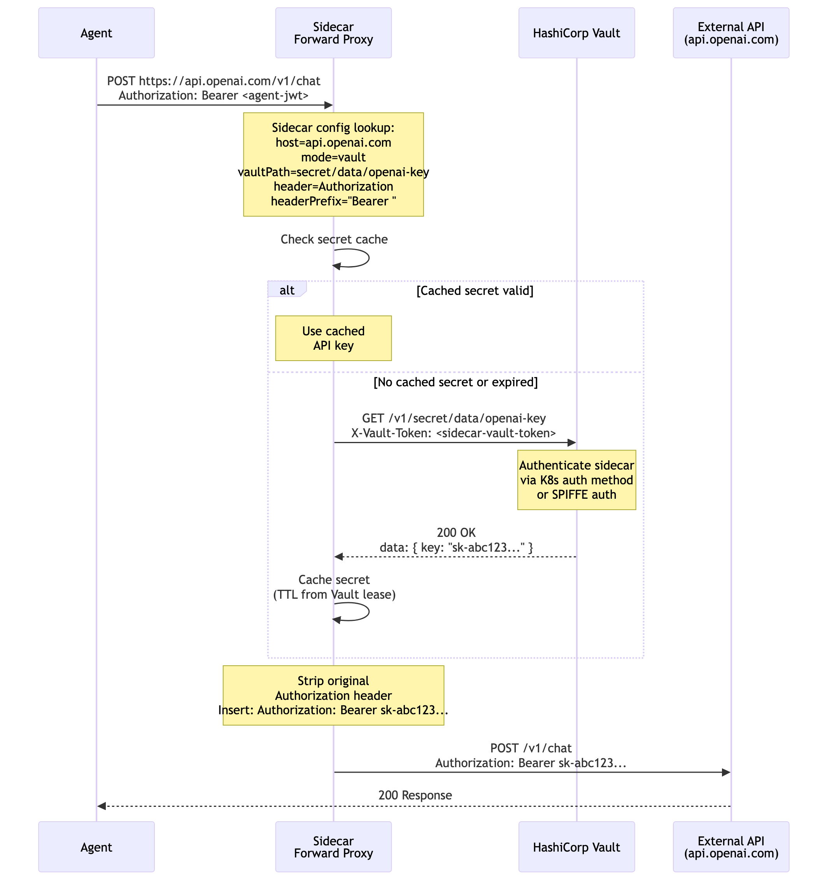

# Authentication and Authorization Concepts

This document explains the auth model for agent access control — what tokens are involved, who validates them, and how credentials flow through the system.

## Auth Components


The system has three layers:

### Identity Layer — "who are you?"

| Component | What it does | When it's used |
|---|---|---|
| **Identity Provider (Keycloak/RHSSO)** | Issues JWTs, handles token exchange (RFC 8693) | Agent identity, scoped token minting |
| **SPIFFE / SPIRE** | Issues short-lived X.509 certificates tied to workloads | Sidecar-to-IDP authentication, workload-to-workload mTLS |
| **Kubernetes ServiceAccount** | Built-in pod identity via projected service account tokens | Fallback when SPIFFE is unavailable |

### Token Types — "what can you do?"

| Token | Issued by | Contains | Used for |
|---|---|---|---|
| **Agent JWT** | Identity Provider | `sub: weather-agent`, `tier: standard`, `allowed_tools: [...]` | Agent's primary identity — presented on all calls |
| **Scoped Token** | Identity Provider (via exchange) | `audience: tool-a`, `scope: read` | Narrowed access to a specific target service |
| **API Key** | External provider (stored in Vault) | Opaque string (e.g., `sk-abc123...`) | Access to external APIs that don't use OAuth |
| **SA Token** | Kubernetes | `sub: system:serviceaccount:ns:name` | Sidecar authenticating to the token endpoint |

### Enforcement Points — "are you allowed?"

| Component | Direction | What it checks |
|---|---|---|
| **Authorino** | Inbound (at gateway) | Is the caller's JWT valid? Is the caller in the AuthPolicy's allowed list? |
| **Limitador** | Inbound (at gateway) | Has this caller exceeded their rate limit? |
| **Sidecar Reverse Proxy** | Inbound (at pod) | Defense-in-depth token validation |
| **Sidecar Forward Proxy** | Outbound (from pod) | Should this outbound call be allowed? What credential to attach? |
| **Vault** | Credential storage | Stores API keys and secrets, accessed by the sidecar |

---

## Auth Flow 1: Inbound — Someone Calling an Agent

This is the most common flow. A user or another agent calls an agent through the gateway.


### What happens step by step

1. **Caller sends request** to the gateway with their JWT in the `Authorization: Bearer` header.

2. **Envoy Gateway** receives the request and routes it based on the HTTPRoute (generated by the controller from the AgentCard).

3. **Authorino** intercepts the request (via ext-authz) and:
   - **Fetches the JWKS** from the issuer URL (cached after first fetch)
   - **Validates the JWT**: signature, expiry, issuer, audience
   - **Checks the AuthPolicy rules**: is the caller's `sub` claim in the `allowedAgents` list? Is the caller in `allowedUsers`?
   - If invalid → **401 Unauthorized**
   - If not authorized → **403 Forbidden**

4. **Limitador** checks the rate limit:
   - Counts requests from this caller within the configured window (e.g., 60/min)
   - If exceeded → **429 Too Many Requests**

5. **Sidecar reverse proxy** (optional defense-in-depth):
   - Can perform a second validation of the token
   - Ensures the request came through the gateway (agent listens on loopback only)

6. **Agent** receives the request on `127.0.0.1:8080` — it never sees or validates the token itself.

### What the AgentPolicy controls

```yaml
ingress:
  allowedAgents: [orchestrator, planner]   # → becomes AuthPolicy CEL predicates
  allowedUsers: ["*"]                       # → allows any authenticated user
rateLimit:
  requestsPerMinute: 60                    # → becomes RateLimitPolicy
```

The controller generates the AuthPolicy and RateLimitPolicy. Authorino and Limitador enforce them. No auth code in the agent.

---

## Auth Flow 2: Outbound — Agent Calling a Service with Token Exchange

When an agent calls an internal service that requires a scoped token (not the agent's broad JWT), the sidecar performs OAuth 2.0 Token Exchange (RFC 8693).


### What happens step by step

1. **Agent makes an HTTP call** to `tool-a.internal`. Because `HTTP_PROXY` is set, the request goes through the sidecar forward proxy.

2. **Sidecar looks up the config** for `tool-a.internal`:
   ```yaml
   - host: tool-a.internal
     mode: exchange
     audience: tool-a
     scopes: [read]
   ```

3. **Sidecar checks its token cache**. If a valid scoped token for `tool-a` exists and hasn't expired, it uses it (skip to step 6).

4. **Sidecar calls the token endpoint** (Keycloak):
   ```
   POST /token
   grant_type=urn:ietf:params:oauth:grant-type:token-exchange
   subject_token=<agent's JWT>           ← "exchange this"
   audience=tool-a                        ← "for access to tool-a"
   scope=read                             ← "with read scope"
   client_assertion=<SPIFFE SVID>         ← "I'm a trusted sidecar"
   ```

5. **Keycloak validates**:
   - Is the agent's JWT valid?
   - Is the sidecar's SPIFFE identity legitimate?
   - Is this agent allowed to get tokens for `tool-a` with `read` scope?
   - If all checks pass → mints a **scoped token** with `audience=tool-a`, `scope=read`, short expiry (e.g., 5 minutes)

6. **Sidecar replaces the Authorization header** with the scoped token and forwards the request to `tool-a.internal`.

7. **Target service validates** the scoped token: correct audience, correct scope, valid signature.

### Why token exchange matters

The agent's primary JWT is broad — it identifies the agent and its tier. You don't want to send that to every service. Token exchange narrows the blast radius:

| Without exchange | With exchange |
|---|---|
| Agent sends its full JWT to every service | Each service gets a token scoped just to it |
| If `tool-a` is compromised, attacker has the agent's full identity | Attacker only has a `tool-a`-scoped token (limited scope, short TTL) |
| All services see the same token | Each service sees a different token tailored to its audience |

### What the AgentPolicy controls

```yaml
external:
  rules:
    - host: tool-a.internal
      mode: exchange
      audience: tool-a
      scopes: [read]
```

The controller puts this in the sidecar's ConfigMap. The sidecar reads it and performs the exchange at runtime.

---

## Auth Flow 3: Outbound — Agent Calling an External API with Vault

When an agent calls an external API that uses API keys (not OAuth), the sidecar fetches the key from Vault and injects it.



### What happens step by step

1. **Agent makes an HTTP call** to `api.openai.com`. The request goes through the sidecar forward proxy.

2. **Sidecar looks up the config** for `api.openai.com`:
   ```yaml
   - host: api.openai.com
     mode: vault
     vaultPath: secret/data/openai-key
     header: Authorization
     headerPrefix: "Bearer "
   ```

3. **Sidecar checks its secret cache**. If a valid secret exists, it uses it (skip to step 5).

4. **Sidecar calls Vault**:
   - Authenticates using Kubernetes auth method (SA token) or SPIFFE auth
   - Reads `secret/data/openai-key`
   - Gets back: `{ "key": "sk-abc123..." }`
   - Caches the secret for the Vault lease duration

5. **Sidecar modifies the request**:
   - Strips the agent's original `Authorization` header
   - Inserts: `Authorization: Bearer sk-abc123...`
   - Forwards the request to `api.openai.com`

6. **OpenAI** validates the API key and responds.

### Why Vault matters

- **Agents never see API keys.** The key exists only in Vault and the sidecar's memory. The agent code has no credentials.
- **Keys are rotated in one place.** Update the secret in Vault, all agents using it get the new key automatically.
- **Audit trail.** Vault logs every secret access — you know which sidecar (which agent) read which key and when.
- **Least privilege.** Each agent's sidecar only has Vault policies to read the secrets configured in its AgentPolicy.

### What the AgentPolicy controls

```yaml
external:
  rules:
    - host: api.openai.com
      mode: vault
      vaultPath: secret/data/openai-key
      header: Authorization
      headerPrefix: "Bearer "
```

---

## Auth Flow 4: Outbound — Agent Calling a Blocked Host

Egress enforcement uses two layers:

1. **NetworkPolicy** (primary): When `defaultMode: deny`, the operator generates a Kubernetes NetworkPolicy that blocks all egress except DNS and the cluster gateway. This is kernel-level enforcement -- the pod cannot bypass it.
2. **Sidecar** (defense-in-depth): The sidecar blocks unmatched hosts at the application layer and returns a 403.


Both layers prevent:

- Agents calling unauthorized services (data exfiltration)
- Prompt injection attacks directing agents to attacker-controlled endpoints
- Accidental calls to production systems from dev agents

NetworkPolicy alone can't do per-host credential injection. The sidecar alone can be bypassed without NetworkPolicy. Together they provide complete egress control.

### What the AgentPolicy controls

```yaml
external:
  defaultMode: deny   # generates NetworkPolicy + sidecar deny
```

---

## How Auth Flows Map to the AgentPolicy

```yaml
apiVersion: kagenti.com/v1alpha1
kind: AgentPolicy
metadata:
  name: standard-tier
spec:
  agentSelector:
    matchLabels:
      tier: standard

  # ──── INBOUND (Flow 1) ────
  # Gateway enforces via AuthPolicy + RateLimitPolicy
  ingress:
    allowedAgents: [orchestrator]    # Authorino checks this
    allowedUsers: ["*"]              # Authorino checks this
  rateLimit:
    requestsPerMinute: 60           # Limitador enforces this

  # ──── OUTBOUND (Flows 2, 3, 4) ────
  # Sidecar enforces via ConfigMap
  external:
    defaultMode: deny               # Flow 4: block unlisted hosts

    rules:
      - host: tool-a.internal       # Flow 2: token exchange
        mode: exchange
        audience: tool-a
        scopes: [read]

      - host: api.openai.com        # Flow 3: vault credential
        mode: vault
        vaultPath: secret/data/openai-key
        header: Authorization
        headerPrefix: "Bearer "

      - host: weather.gov           # Passthrough: no credential changes
        mode: passthrough
```

One CRD, four auth flows, two enforcement points (gateway + sidecar), zero auth code in the agent.

---

## Auth Component Summary

| Component | Role | Configured by |
|---|---|---|
| **Keycloak / RHSSO** | Issues agent JWTs, performs token exchange | Platform team (realm, clients, policies) |
| **Authorino** | Validates inbound JWTs, checks ServiceAccount-based authorization | Controller (generates AuthPolicy from AgentPolicy) |
| **Limitador** | Enforces rate limits per caller | Controller (generates RateLimitPolicy from AgentPolicy) |
| **NetworkPolicy** | Primary egress enforcement: deny-all + allow DNS + allow gateway | Controller (generates NetworkPolicy from AgentPolicy) |
| **Sidecar Forward Proxy** | Defense-in-depth: per-host credential injection and routing | Controller (generates ConfigMap from AgentPolicy) |
| **Sidecar Reverse Proxy** | Defense-in-depth inbound validation | Sidecar configuration |
| **Vault** | Stores API keys and secrets | Platform team / ops |
| **SPIFFE / SPIRE** | Workload identity for sidecar authentication | Platform infrastructure |

## What the Agent Developer Needs to Know About Auth

Nothing. They deploy their agent. The platform handles everything.

---

## Deep Dive: How Authorino Intercepts Requests via ext-authz

This section explains the mechanics of how Authorino gets into the request path and what it does at request time.

### The Wiring — Three Layers

**Layer 1: Envoy Gateway registers Authorino as an ext-authz filter.**
When Kuadrant is installed on a cluster, it patches the Envoy Gateway's `EnvoyProxy` configuration to add an external authorization filter pointing at Authorino's gRPC service. This happens at the infrastructure level and is not managed by the agent-access-control controller. Conceptually:

```yaml
# Managed by Kuadrant operator at install time
envoy.filters.http.ext_authz:
  grpc_service:
    envoy_grpc:
      cluster_name: authorino-authorino-authorization
    timeout: 1s
```

Every request that hits Envoy Gateway is paused and forwarded to Authorino for a decision before proceeding to the backend.

**Layer 2: The agent-access-control controller creates an AuthPolicy targeting the HTTPRoute.**
The `BuildAuthPolicy` function generates a Kuadrant `AuthPolicy` CR that references the HTTPRoute for a specific agent. The `targetRef` tells Authorino which routes these rules apply to:

```yaml
spec:
  targetRef:
    group: gateway.networking.k8s.io
    kind: HTTPRoute
    name: agent-weather       # matches the route for this agent
```

**Layer 3: Authorino watches AuthPolicy CRs and builds its internal config.**
Authorino runs as a Kubernetes controller. When it sees an AuthPolicy, it creates an internal `AuthConfig` that maps the HTTPRoute's host/path combination to the authentication and authorization rules defined in that policy.

### Request-Time Flow

```
Caller → Envoy Gateway → [ext-authz gRPC call] → Authorino → decision
                                                      │
                                                      ├─ Phase 1: Authentication (JWT)
                                                      ├─ Phase 2: Authorization (pattern matching)
                                                      └─ Returns: OK / 401 / 403
```

#### Phase 1: Authentication — JWT Validation

The AuthPolicy configures a `jwt-auth` identity source with an `issuerUrl`:

```yaml
rules:
  authentication:
    jwt-auth:
      jwt:
        issuerUrl: "https://issuer.example.com"
```

Authorino performs these steps:

1. **Extracts the JWT** from the `Authorization: Bearer <token>` header.

2. **Fetches the JWKS** — on first request, Authorino calls `https://issuer.example.com/.well-known/openid-configuration`, reads the `jwks_uri` field, and fetches the public keys. These are cached in memory and refreshed periodically (or when signature verification fails, triggering a re-fetch).

3. **Validates the JWT**:
   - **Signature**: verifies using the JWKS public key matching the `kid` header in the JWT
   - **Expiry**: checks the `exp` claim against current time
   - **Issuer**: confirms the `iss` claim matches the configured `issuerUrl`
   - **Audience**: if configured, checks the `aud` claim (see [sub vs aud](#jwt-claims-sub-vs-aud) below)

4. If any check fails, Authorino returns **401 Unauthorized**. The request never reaches the backend.

5. If valid, Authorino stores the decoded JWT payload internally as `auth.identity`, making all claims available to the authorization phase.

#### Phase 2: Authorization — Pattern Matching

The controller translates the `allowedAgents` list into Authorino pattern-matching predicates:

```yaml
rules:
  authorization:
    agent-access:
      patternMatching:
        patterns:
          - selector: auth.identity.sub
            operator: eq
            value: orchestrator
          - selector: auth.identity.sub
            operator: eq
            value: planner
```

Authorino evaluates these patterns with **OR** logic — the request is authorized if the JWT's `sub` claim matches **any** of the listed values:

- JWT `sub: "orchestrator"` matches the first pattern — **allowed**
- JWT `sub: "planner"` matches the second pattern — **allowed**
- JWT `sub: "random-agent"` matches nothing — **403 Forbidden**

### Response Summary

| Condition | Who decides | HTTP status |
|---|---|---|
| No JWT or malformed JWT | Authorino (authn phase) | 401 |
| Invalid signature, expired, or wrong issuer | Authorino (authn phase) | 401 |
| Valid JWT but `sub` not in allowedAgents | Authorino (authz phase) | 403 |
| Authorized but rate limit exceeded | Limitador | 429 |
| All checks pass | Envoy forwards to backend | 200 (or agent response) |

---

## JWT Claims: `sub` vs `aud`

Both are standard JWT claims defined in RFC 7519, but they answer different questions.

### `sub` (Subject) — "Who is the caller?"

The `sub` claim identifies the entity making the request. It's a unique identifier for the principal.

```json
{
  "sub": "orchestrator",
  "iss": "https://keycloak.example.com/realms/agents",
  "exp": 1740268800
}
```

This token says: "I am `orchestrator`." When Authorino checks `auth.identity.sub == "orchestrator"`, it's answering whether the caller is someone the policy trusts.

Different callers get different `sub` values:

| Caller type | Example `sub` value |
|---|---|
| An agent | `weather-agent` |
| A human user | `alice@example.com` |
| A service account | `system:serviceaccount:ns:sa-name` |

### `aud` (Audience) — "Who is this token intended for?"

The `aud` claim identifies the recipient the token was created for. It prevents token misuse across services.

```json
{
  "sub": "orchestrator",
  "aud": "weather-agent",
  "iss": "https://keycloak.example.com/realms/agents"
}
```

This token says: "I am `orchestrator`, and this token was specifically minted for use with `weather-agent`." If someone intercepts this token and tries to use it against `planner-agent`, the audience check fails — the token wasn't intended for that service.

### How They Work Together

| Claim | Question | Example | Who sets it |
|---|---|---|---|
| `sub` | Who is calling? | `orchestrator` | Identity provider, based on client credentials |
| `aud` | Who should accept this token? | `weather-agent` | Identity provider, based on token request parameters |

A concrete scenario:

1. `orchestrator` wants to call `weather-agent`
2. Gets a JWT from Keycloak with `sub=orchestrator`, `aud=weather-agent`
3. Sends it to `weather-agent`'s gateway endpoint
4. Authorino checks:
   - `aud == "weather-agent"`? — is this token meant for me? Yes.
   - `sub == "orchestrator"`? — is this caller in my allowedAgents? Yes.
   - Both pass — **200**

If `orchestrator` reuses that same token against `planner-agent`:
- Authorino at `planner-agent` checks `aud == "planner-agent"`? — No, token says `weather-agent` — **401 Unauthorized**

---

## Why JWT Claims Cannot Be Fabricated

A JWT has three parts separated by dots:

```
eyJhbGciOiJSUzI1NiJ9.eyJzdWIiOiJvcmNoZXN0cmF0b3IifQ.kX9s7...
│                      │                                    │
Header (base64)        Payload (base64)                     Signature
```

The payload is plain JSON — anyone can decode it and read the claims. Anyone can also write their own JSON with `"sub": "orchestrator"`. But they cannot produce a valid signature for it.

### The cryptographic guarantee

1. **Keycloak holds a private key** (RSA or ECDSA). When it issues a JWT, it signs `header + "." + payload` with that private key. The signature is the third segment of the token.

2. **Authorino holds only the public key** (fetched from the JWKS endpoint). The public key can verify signatures but cannot create them.

3. **If an attacker changes any byte in the payload** — changing `sub` from `"random-agent"` to `"orchestrator"` — the signature no longer matches. Authorino computes the expected signature from the modified payload using the public key, sees it doesn't match the actual signature, and returns **401**.

Forging a valid signature requires Keycloak's private key. That key never leaves Keycloak's memory.

### Attack scenarios

| Attack | What happens |
|---|---|
| Fabricate a JWT from scratch with fake `sub`/`aud` | No valid signature — Authorino rejects — **401** |
| Take a valid JWT and edit the `sub` claim | Signature breaks — **401** |
| Take a valid JWT and replay it to a different service | Signature is valid, but `aud` doesn't match (if audience is checked) — **401** |
| Take a valid JWT and replay it to the correct service | Works, but the token has `exp` (expiry), typically 5-15 minutes |

### The trust chain

```
Keycloak (private key)
    │
    │  signs JWT — sub, aud, exp are tamper-proof
    │
    ▼
JWKS endpoint (public key)
    │
    │  Authorino fetches and caches this
    │
    ▼
Authorino verifies signature
    │
    │  signature valid? → check sub against allowedAgents
    │  signature invalid? → 401
    │
    ▼
Request reaches agent (or doesn't)
```

### Mitigations for token theft

The one real risk is stealing a legitimately-issued token and replaying it before it expires. The system mitigates this through:

- **Short expiry** (`exp`) limits the replay window to minutes
- **Audience** (`aud`) limits where a stolen token can be used
- **TLS everywhere** prevents network-level interception
- **Token exchange** (Auth Flow 2) means agents use narrowly-scoped tokens instead of passing around their broad identity JWT
