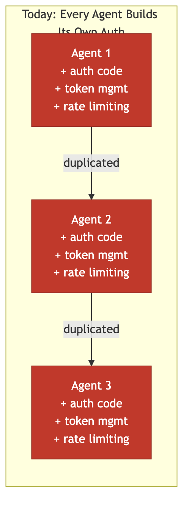
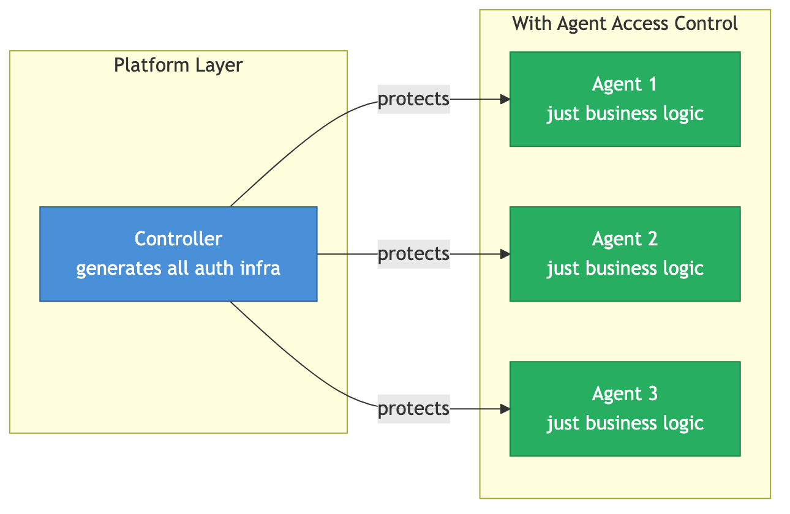
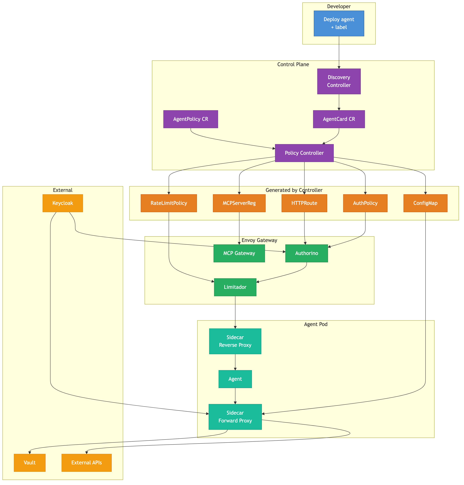
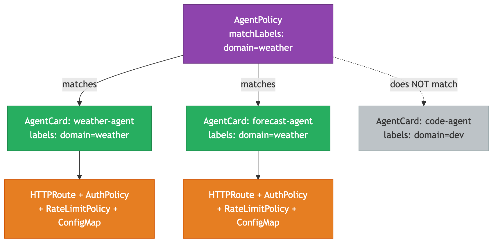
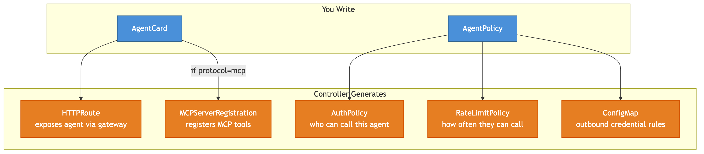
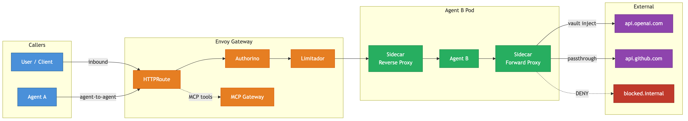
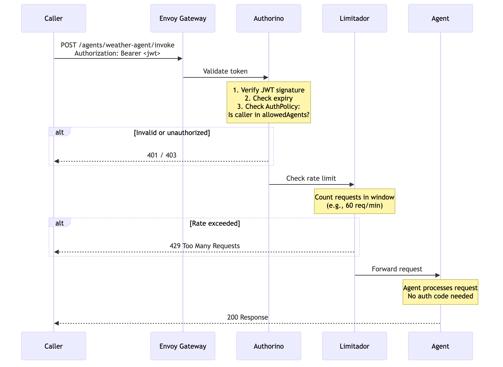
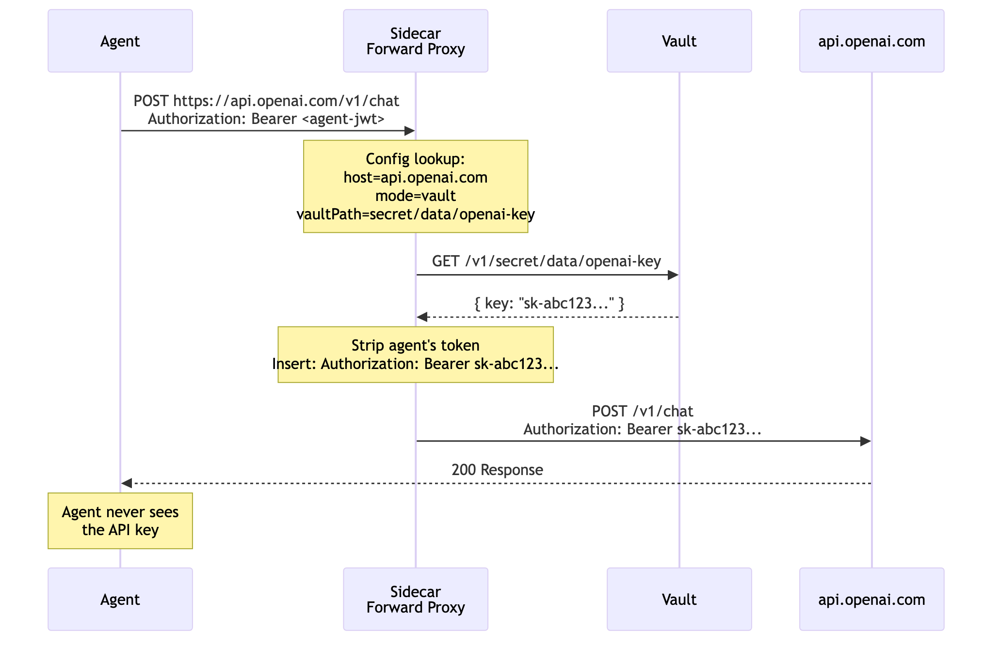
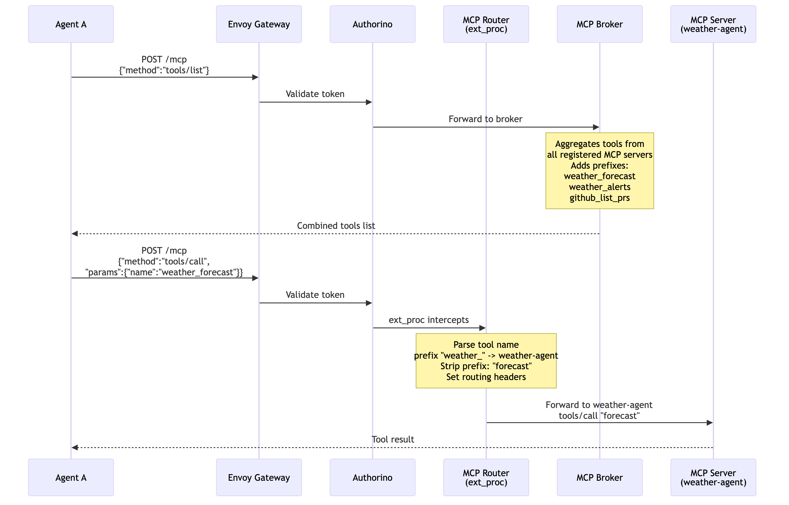
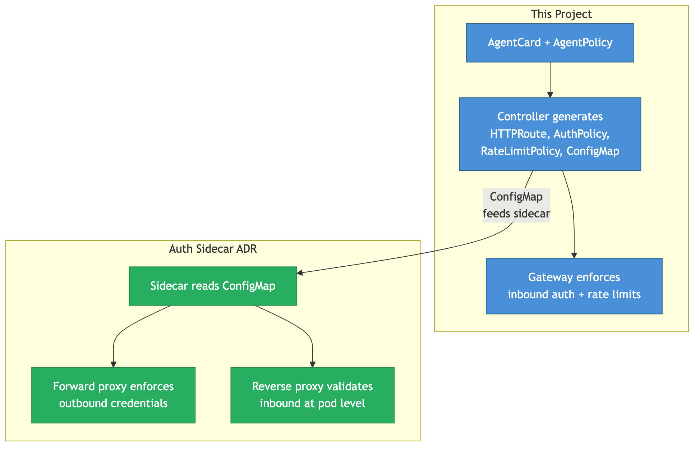

# Agent Access Control — Demo Walkthrough

## The Problem

AI agents are programs that make decisions and take actions autonomously. When you deploy agents on Kubernetes, they need to:

- **Call external APIs** (OpenAI, GitHub, weather services) — often with API keys or tokens
- **Call other agents** — an orchestrator agent might delegate work to a research agent
- **Expose tools via MCP** — Model Context Protocol lets agents share capabilities
- **Be called by users or other agents** — someone needs to invoke them

Today, every agent team builds this security from scratch:



Each agent duplicates the same auth code, token management, and rate limiting logic. It's error-prone, inconsistent, and slows development.

## What We Built

A platform-level controller that handles all of this automatically:



Agents contain only business logic. The controller generates all auth infrastructure. Two personas, clean separation:

- **AI Engineers** build their agent, push the image, add a label to their Deployment manifest, and commit to git. No CRDs, no gateway config, no auth code, no `kubectl`.
- **Platform Engineers** own the GitOps pipeline, write `AgentPolicy` CRs to define security rules per tier, and manage cluster infrastructure.

### Full System Architecture

Here is the complete system — from AI Engineer to external APIs:



The system has six layers: AI Engineer → Control Plane → Generated Resources → Gateway → Agent Pod → External Services. Each layer handles a specific concern, and data flows top-to-bottom (deployment) and left-to-right (runtime requests).

---

## Key Concepts

Before walking through the demo, here are the core ideas.

### Concept 1: Agent Discovery

Agents are not manually registered. A discovery controller finds them automatically:


1. AI Engineer adds a label (`kagenti.com/agent=true`) to their Deployment manifest and commits to git
2. Discovery controller detects the pod
3. Fetches the agent's metadata (A2A agent card at `/.well-known/agent.json` or MCP `tools/list`)
4. Creates an `AgentCard` CR — the platform's internal representation of the agent
5. The policy controller sees the AgentCard and generates infrastructure

The AI Engineer never writes a CRD. The AgentCard is discovered, like a Kubernetes Node.

Here's the full sequence from deployment to enforcement:


The AI Engineer commits once. The Platform Engineer writes one policy. GitOps deploys. Five resources are generated automatically. The gateway starts enforcing immediately.

### Concept 2: Policy Matching

An `AgentPolicy` selects agents by label — not by name. One policy can cover many agents:



The policy `matchLabels: domain=weather` matches both `weather-agent` and `forecast-agent`, but not `code-agent`. Each matched agent gets its own set of generated resources.

This means the platform team writes policies per group (by domain, team, environment, etc.), not per individual agent.

### Concept 3: What Gets Generated

From two CRDs, the controller generates five types of Kubernetes resources:



| Resource | What it does | Who enforces it |
|---|---|---|
| **HTTPRoute** | Exposes the agent through the gateway | Gateway API |
| **AuthPolicy** | Controls who can call the agent | Authorino (Kuadrant) |
| **RateLimitPolicy** | Limits request rate | Limitador (Kuadrant) |
| **ConfigMap** | Sidecar outbound credential config | Auth sidecar |
| **MCPServerRegistration** | Registers MCP tools | MCP Gateway |

### Concept 4: Inbound vs Outbound

The system splits enforcement into two directions:



**Inbound** (someone calling this agent):
- Handled by the **gateway** (Authorino for auth, Limitador for rate limits)
- Configured via `ingress` and `rateLimit` in the AgentPolicy

**Outbound** (this agent calling something else):
- Agent-to-agent calls go through the **gateway** (same auth enforcement)
- External API calls go through the **sidecar** (token exchange, Vault, deny)
- Configured via `agents` and `external` in the AgentPolicy

#### Sequence: Inbound call (user or agent calling this agent)



The caller's JWT is validated by Authorino, rate-checked by Limitador, then forwarded to the agent. The agent never validates tokens — the gateway already did.

#### Sequence: Agent-to-agent call


Agent A's call goes through its sidecar (passthrough to gateway), then through the gateway where Authorino checks whether Agent A is in Agent B's `allowedAgents` list. The gateway enforces the policy — neither agent has auth code.

#### Sequence: Outbound call to external API (Vault credential injection)



The sidecar intercepts the outbound call, fetches the API key from Vault, replaces the Authorization header, and forwards. The agent never sees the API key.

#### Sequence: MCP tool call through MCP Gateway



The MCP Gateway aggregates tools from multiple MCP servers into a single `/mcp` endpoint. The Router (ext_proc) parses the tool name prefix to determine which backend server handles the call. Tools are filtered per-agent via MCPVirtualServer.

### Concept 5: How This Complements the Auth Sidecar ADR

This project and the Auth Sidecar ADR are two halves of the same system:



- **This project** generates the policy infrastructure (gateway config + sidecar config)
- **The ADR's sidecar** enforces outbound rules at runtime using the generated ConfigMap

Without the controller, someone manually writes sidecar config per pod. Without the sidecar, the ConfigMap has no runtime to enforce it.

---

## The Demo — Step by Step

### What we started with

An OpenShift cluster with:
- **Gateway API** — Kubernetes-native traffic routing (HTTPRoutes, Gateways)
- **Kuadrant** — policy enforcement with Authorino (auth) and Limitador (rate limiting)

These are general-purpose infrastructure. They don't know anything about agents.

### Step 1: Install the CRDs

```
kubectl apply -f config/crd/bases/
```

This taught Kubernetes two new resource types:
- `AgentCard` — represents a discovered agent
- `AgentPolicy` — declares access control rules

### Step 2: Deploy dummy agents

We created two fake agents (web servers simulating agents) with Services:

```
weather-agent-svc      → port 8080
code-review-agent-svc  → port 8080
```

In production, these would be real A2A or MCP agents. The controller only needs a Service to route to.

### Step 3: AgentCards (simulating discovery)

In production, a discovery controller creates these automatically. For the demo, we created them manually:

```yaml
apiVersion: kagenti.com/v1alpha1
kind: AgentCard
metadata:
  name: weather-agent
  labels:
    domain: weather
spec:
  description: "Agent providing weather forecasts and alerts"
  protocols: [a2a, rest]
  skills:
    - name: get-forecast
    - name: weather-alerts
```

### Step 4: AgentPolicies

The platform team creates policies per group:

```yaml
apiVersion: kagenti.com/v1alpha1
kind: AgentPolicy
metadata:
  name: weather-policy
spec:
  agentSelector:
    matchLabels:
      domain: weather           # matches weather-agent

  ingress:                       # WHO can call this agent
    allowedAgents: [orchestrator, planner]
    allowedUsers: ["*"]

  agents: [summarizer]           # WHO this agent can call

  external:                      # WHAT external APIs it can reach
    defaultMode: deny            # block everything by default
    rules:
      - host: api.openweathermap.org
        mode: vault              # fetch API key from Vault
        vaultPath: secret/data/openweathermap
        header: x-api-key
      - host: weather.gov
        mode: passthrough        # no auth needed

  rateLimit:
    requestsPerMinute: 60
```

This single YAML says:
- Only `orchestrator` and `planner` can call weather-agent
- Weather-agent can call `summarizer`
- Weather-agent can reach `api.openweathermap.org` (Vault key) and `weather.gov`
- Everything else is blocked
- Rate limited to 60 req/min

### Step 5: Start the controller

```
go run ./cmd/main.go --gateway-name=data-science-gateway --gateway-namespace=openshift-ingress
```

### What happened automatically

The controller generated **8 resources** from 2 AgentCards + 2 AgentPolicies:

| Generated | Agent | Purpose |
|---|---|---|
| HTTPRoute `agent-weather-agent` | weather-agent | Routes `/agents/weather-agent/*` to the agent |
| HTTPRoute `agent-code-review-agent` | code-review-agent | Routes `/agents/code-review-agent/*` |
| AuthPolicy `ap-weather-agent` | weather-agent | Only orchestrator + planner can call |
| AuthPolicy `ap-code-review-agent` | code-review-agent | orchestrator + planner + qa-agent can call |
| RateLimitPolicy `rlp-weather-agent` | weather-agent | 60 req/min |
| RateLimitPolicy `rlp-code-review-agent` | code-review-agent | 200 req/min |
| ConfigMap `sidecar-config-weather-agent` | weather-agent | Vault for openweathermap, passthrough for weather.gov |
| ConfigMap `sidecar-config-code-review-agent` | code-review-agent | Exchange for github, vault for openai |

### Kuadrant enforcement verified

```
HTTPRoute status:
  - AuthPolicyAffected: True      ← Authorino enforcing auth
  - RateLimitPolicyAffected: True ← Limitador enforcing rate limits
```

The agent endpoints are protected on the live cluster. No auth code was written.

### Sidecar ConfigMap contents

```yaml
gateway:
  host: agent-gateway.agent-demo.svc.cluster.local
  mode: passthrough

allowedAgents:
  - summarizer
  - classifier

external:
  defaultMode: deny
  rules:
    - host: api.openweathermap.org
      mode: vault
      vaultPath: secret/data/openweathermap
      header: x-api-key
    - host: weather.gov
      mode: passthrough
```

The auth sidecar (from the ADR) reads this config and enforces outbound rules at runtime.

### Cascade deletion

```
kubectl delete agentcard weather-agent
```

The HTTPRoute, AuthPolicy, RateLimitPolicy, and ConfigMap were all cleaned up automatically via Kubernetes owner references. Recreating the AgentCard regenerated everything within seconds.

---

## How This Relates to the Auth Sidecar ADR

The ADR by Gordon Sim proposes an auth sidecar container with:
- A **reverse proxy** (validates tokens on incoming requests)
- A **forward proxy** (swaps/inserts tokens on outgoing requests)
- SPIFFE identity, token exchange, Vault integration

### They solve different layers

| Concern | ADR (Sidecar) | This project |
|---|---|---|
| **Focus** | Per-pod credential management | Centralized policy + generation |
| **Inbound auth** | Sidecar reverse proxy | Gateway + Authorino |
| **Outbound auth** | Sidecar forward proxy | Sidecar (config from controller) |
| **Rate limiting** | Not addressed | Limitador |
| **Agent discovery** | Not addressed | AgentCard CRD |
| **Agent routing** | Not addressed | HTTPRoute via Gateway |
| **MCP federation** | Not addressed | MCP Gateway |
| **Policy management** | Per-pod config | Centralized AgentPolicy CRD |
| **SPIFFE identity** | Built in | Supported via sidecar |

### What each adds

**This project adds:**
- Declarative policy (one CRD, not per-pod config)
- Centralized management (change policy, all agents update)
- Inbound enforcement at the gateway
- Rate limiting with centralized counters
- Agent discovery and automatic routing
- MCP tool federation
- Lifecycle management (owner references)

**The ADR adds:**
- Runtime outbound token exchange
- SPIFFE workload identity
- Pod isolation (loopback binding)
- Runtime enforcement of the generated config

### The complete architecture

| Layer | Component | What it does |
|---|---|---|
| **Discovery** | Discovery Controller | Finds agents, creates AgentCards |
| **Policy** | AgentPolicy CRD | Declares access rules |
| **Control plane** | This controller | Generates gateway + sidecar config |
| **Inbound enforcement** | Gateway + Authorino + Limitador | Auth and rate limiting |
| **MCP enforcement** | MCP Gateway | Tool federation and routing |
| **Outbound enforcement** | Auth Sidecar (ADR) | Token exchange, Vault, deny lists |

---

## Summary

What we demonstrated:

1. **Installed 2 CRDs** on a live OpenShift cluster
2. **Created 2 AgentCards** (simulating discovery)
3. **Created 2 AgentPolicies** (one per domain)
4. **Controller generated 8 resources** automatically
5. **Kuadrant enforcing** auth and rate limits on live endpoints
6. **Cascade deletion** cleans up everything
7. **Zero code changes** to the agents

### The production experience (by persona)

```
AI Engineer:
  1. Build agent that serves A2A or MCP protocol
  2. Push image to registry
  3. Add label kagenti.com/agent=true to Deployment manifest
  4. Commit to git
  Done. No CRDs, no kubectl, no gateway config, no auth code.

Platform Engineer:
  1. Set up GitOps pipeline (ArgoCD/Flux) for agent repos
  2. Define AgentPolicy CRs per tier (standard, premium, etc.)
  3. Commit policies to the platform repo
  Done. GitOps syncs everything. One policy covers all agents matching the label.

Operator (automatic):
  1. GitOps deploys agent pod from git
  2. Discovery controller finds the labeled agent
  3. Fetches /.well-known/agent.json or tools/list
  4. Creates AgentCard CR
  5. AgentPolicy matches by label
  6. Controller generates HTTPRoute, AuthPolicy, RateLimitPolicy, ConfigMap
  7. Gateway and sidecar enforce everything
```

The AI Engineer never writes a CRD, never runs kubectl, never configures a gateway, never manages tokens. The Platform Engineer never touches agent code.
